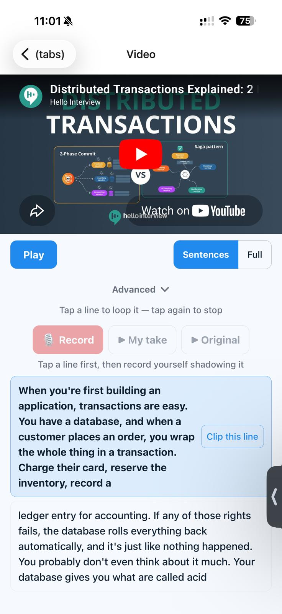
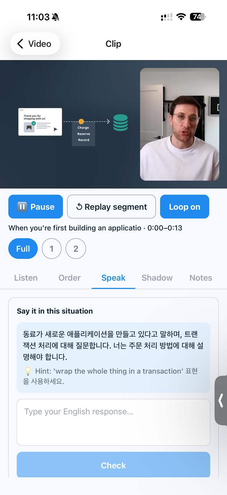
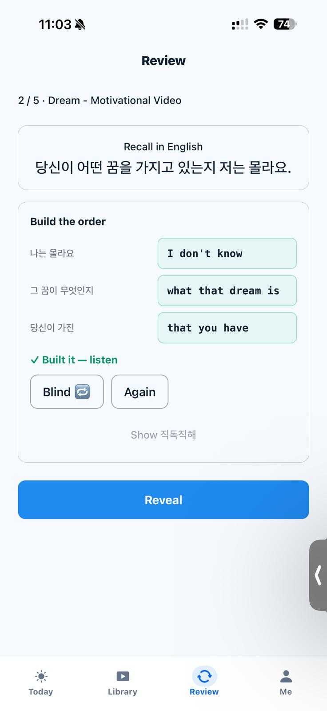
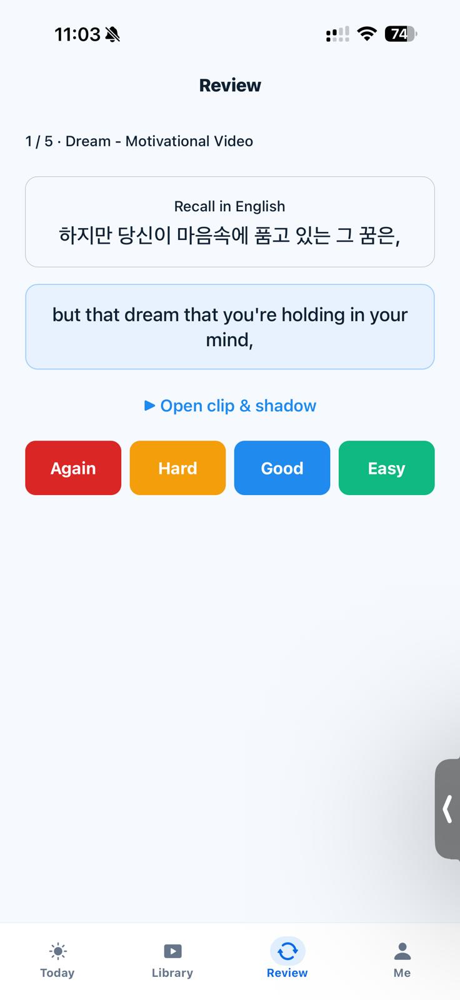
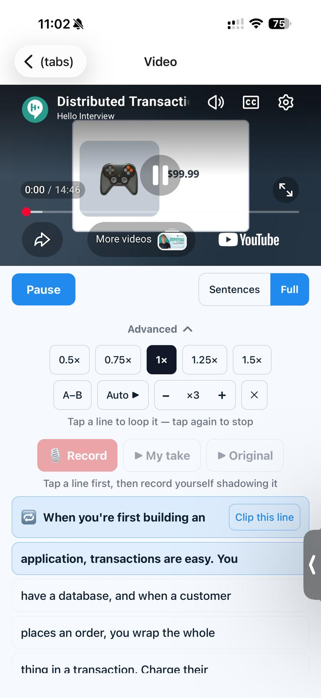
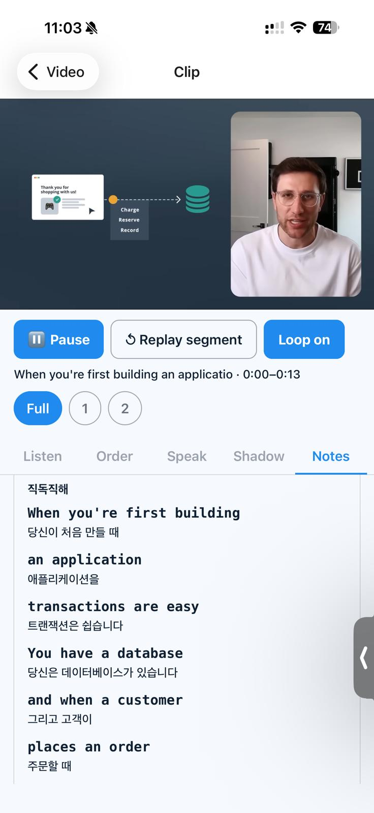
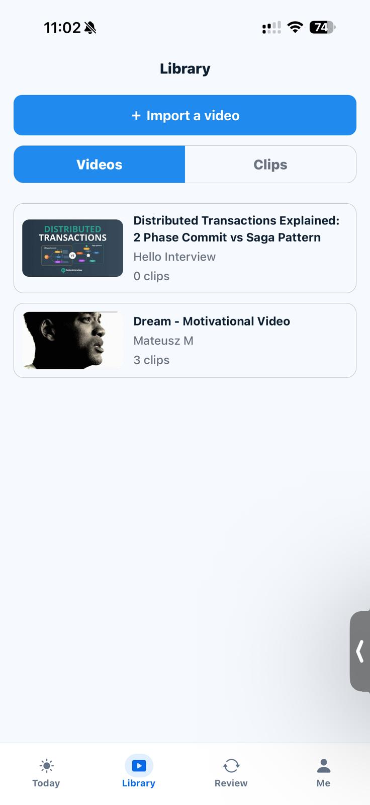
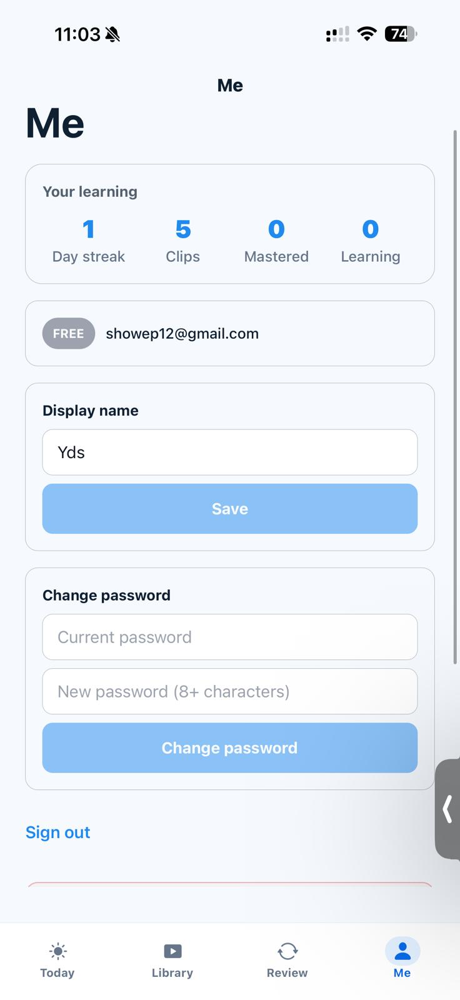

<div align="center">

# Mimi

**Turn any YouTube video into spaced-repetition English shadowing — plus daily drills for the grammar patterns, collocations, and prepositions that never come automatically.**

<sub>A full-stack English-learning app for developers who *read* English fluently but freeze when they have to *produce* it.</sub>

**English** · [한국어 README →](./README.ko.md)

[**🌐 Frontend → mimi.daeseon.ai**](https://mimi.daeseon.ai) &nbsp;·&nbsp; [**📓 Build log → daeseon.ai/projects/shadow-ai**](https://daeseon.ai/projects/shadow-ai)

<p>




</p>

<sub><b>Shadow</b> from YouTube · <b>Speak</b> in a scenario · <b>Build</b> the sentence · <b>Review</b> on an SM-2 schedule &nbsp;—&nbsp; native iOS, in App Store review</sub>


</div>

---

### ⚡ 30-second tour

- 🧑‍💻 **Solo-built, full-stack, and shipped** — a Java/Spring Boot API, a Next.js/TypeScript web app (**live at [mimi.daeseon.ai](https://mimi.daeseon.ai)**), and a native iOS app (Expo / React Native, in App Store review). One person, three surfaces, end to end.
- ⚙️ **Transaction-safe async AI pipeline** — clip analysis runs *outside* the DB transaction (`@TransactionalEventListener(AFTER_COMMIT)` + `@Async`), so a slow or throttled LLM call can never pin a connection-pool connection.
- 🧮 **Two spaced-repetition schedulers, by design** — SM-2 for graded clip review, Leitner for binary drills — each matched to its grading shape, both written as pure, I/O-free functions.
- 🔐 **Built like production, not a demo** — per-user data isolation at the query layer, JWT revocation on password change, two separate rate limiters, recordings streamed through the backend (never public URLs), and **$0 marginal cost** via a JSONB analysis cache (one LLM call per clip, ever).
- ✅ **Verified, not vibes** — Testcontainers against real PostgreSQL + Vitest + Playwright E2E, plus a written, anti-hallucination decision log (literal errors, verified causes, commit hashes).

<sub>Want the depth? Keep scrolling — [why this project](#why-this-project) · [architecture](#architecture) · [security](#security--privacy). Prefer to click around? [Live app →](https://mimi.daeseon.ai)</sub>

---

> **The longer story.** A solo-built, full-stack English-learning app — Java/Spring Boot API + Next.js/TypeScript frontend. It has **two halves that feed each other**: (1) *shadow from YouTube* — clip a subtitle range and one LLM call returns a translation, a word-by-word literal gloss, vocabulary, per-preposition notes, and a practice scenario (cached in JSONB, so studying never re-bills the API), then **SM-2** spaced repetition schedules it; (2) the *Practice hub* — daily **Leitner**-spaced drills over 82 sentence patterns, 101 word+preposition collocations, animated preposition diagrams, an **AI composition check**, and a weak-spots dashboard. The LLM provider (Gemini ↔ Claude) and recording storage (local FS ↔ S3/R2) flip **by environment variable alone**. Hardened from a prioritized codebase audit (7 batches), content **accuracy-audited**, and covered by Testcontainers + Vitest + Playwright.

## Table of contents

- [What is Mimi?](#what-is-mimi)
- [Why this project](#why-this-project)
- [Product walkthrough](#product-walkthrough)
- [Tech stack](#tech-stack)
- [Architecture](#architecture)
- [Security & privacy](#security--privacy)
- [Data model & API](#data-model--api)
- [Run it locally](#run-it-locally)
- [Deployment](#deployment)
- [Testing](#testing)
- [Engineering log](#engineering-log)
- [Honest limitations](#honest-limitations)
- [Project layout](#project-layout)

---

## What is Mimi?

Most developers read English docs all day and still freeze when they have to *speak* or *write* it. Mimi turns the input you already consume (YouTube) into the output practice you avoid — and drills the specific things that never come automatically (prepositions, fixed chunks, sentence frames) every day.

The thesis is **friction removal, not feature count**: input → output → repeat, the loop language-acquisition research actually supports. No pronunciation scoring, no AI essay grading, no social feed.

---

## Why this project

> *For reviewers in a hurry — the engineering this repo demonstrates.*

- **🔀 Env-gated provider & storage.** The *same code* runs locally and switches to real infrastructure **per env var** — `tubeshadow.ai.provider` picks Gemini or Claude (`@ConditionalOnProperty`, zero call-site changes), `RECORDING_STORAGE` picks local-disk or S3/R2 (objects streamed through the backend, owner-gated). No rebuild; decided at a single seam.
- **⚙️ Transaction-safe async AI pipeline.** Creating a clip publishes a domain event; analysis runs on a background thread via `@TransactionalEventListener(AFTER_COMMIT)` + `@Async`, so the multi-second LLM HTTP call runs **outside any DB transaction** and never pins a connection-pool connection — only the small `PENDING → READY/FAILED` writes are transactional. Transient provider failures retry (429/5xx/timeout); permanent ones fail fast.
- **🧮 Two SRS algorithms, matched to the grading shape.** Clip review uses **SM-2** (Again/Hard/Good/Easy). The drills are binary (Got it / Again), so forcing SM-2's 0–5 scale onto two buttons would be the wrong tool — they use a **Leitner box** system instead. Both schedulers are I/O-free pure functions.
- **💸 $0 marginal cost + abuse guards.** Each clip triggers exactly one LLM call, cached in JSONB; every later review/quiz reads the cache. The one authed endpoint that *does* cost money — the AI composition check — is **rate-limited per user**, separate from the IP-based limiter on signup/login.
- **🔐 Multi-tenant safety.** Stateless JWT (HS256) with a **token-version revocation** claim (a password change invalidates older tokens), BCrypt hashing, per-user isolation at the query layer (`findByIdAndUserId`), and access-controlled recordings that are **never served from a public URL** — bytes stream through the backend.
- **📈 Observability.** MDC-tagged structured logs (request id + user id) and Micrometer/Actuator metrics exported to Prometheus (`/actuator/prometheus`), including custom AI-path timings.
- **🧭 Decisions are written down.** Every non-trivial fix/decision is dual-written to a problem-indexed troubleshooting log and a dated narrative (the [daeseon.ai timeline](https://daeseon.ai/projects/shadow-ai)) — with literal error text, verified causes, and post-commit hashes.
- **🌏 Bilingual (ko/en) UI** with SSR + path-based routing, and a strict **content accuracy audit** — every drill cue and model sentence reviewed before merge, because in a learning tool a wrong example is worse than none.

---

## Product walkthrough

<div align="center">

<table>
<tr>
<td width="25%"><br/><sub><b>Shadow</b> any YouTube video, line by line</sub></td>
<td width="25%"><br/><sub><b>Loop &amp; speed</b> — 0.5–1.5×, A–B repeat</sub></td>
<td width="25%"><br/><sub><b>Speak</b> — respond to a situation</sub></td>
<td width="25%"><br/><sub><b>직독직해</b> word-by-word notes</sub></td>
</tr>
<tr>
<td width="25%"><br/><sub><b>Build the order</b> — sentence structure</sub></td>
<td width="25%"><br/><sub><b>Review</b> — SM-2 spaced repetition</sub></td>
<td width="25%"><br/><sub><b>Library</b> — your videos &amp; clips</sub></td>
<td width="25%"><br/><sub><b>Progress</b> — streak, clips, mastery</sub></td>
</tr>
</table>

<sub>Screens from the iOS build (Mimi: English Shadowing).</sub>

</div>

| Flow | What happens |
|---|---|
| **Sign in** | Email/password + JWT; per-user data from day one. |
| **Import** | YouTube URL → metadata (oEmbed) + subtitles (`yt-dlp`); re-import self-heals a missing transcript. |
| **Clip** | Range by subtitle-click or start/end, auto transcript slice, loop + 0.5–1.5× speed, blind mode (full / first-letter / blocked), audio-only mode. |
| **AI analysis** | One LLM call → translation + word-by-word gloss (직독직해) + vocabulary + per-preposition notes + scenario, cached in JSONB. |
| **Review** | SM-2 queue, three modes: *reveal* · *write* (L1 prompt → English, token-level diff) · *scenario* (AI situation → response). |
| **Practice — Patterns** | 82 sentence frames / 246 say-it-aloud items (the "as" family, relatives, indirect questions, conditionals, verb patterns…). |
| **Practice — Collocations** | 101 word+preposition chunks, General / Dev·IT filter. |
| **Practice — Prepositions** | Animated per-sense SMIL diagrams + a fill-in drill + the prepositions mined from your own clips. |
| **Practice — Compose** | Write your own sentence using a target → AI judges correctness, whether it used the target, and a better version. |
| **Practice — Weak spots** | High-lapse cards surfaced from the daily-grade data; seen / misses / mastered stats. |
| **Drill engine** | Leitner SRS box per card (account-persisted), a shared daily streak, and the model sentence spoken aloud (Web Speech API). |
| **Record + A/B** | Record yourself, then play "original → you" back to back. |
| **Decks & playlist** | Anki-style grouping (deleting a deck keeps the clips → Inbox); play a deck end-to-end with autoplay. |
| **BYOAI** | Send the analysis prompt to your own ChatGPT / Claude / Gemini — zero cost to the app. |

---

## Tech stack

| Layer | Choice |
|---|---|
| **Backend** | Java 21 · Spring Boot 3.3.5 · Gradle (Kotlin DSL) · Spring Security + JWT (HS256) · Spring Data JPA |
| **Database** | PostgreSQL 16 · Flyway (17 migrations) · raw-SQL `CHECK` constraints + JPA mapping |
| **Async / resilience** | `@TransactionalEventListener(AFTER_COMMIT)` + `@Async` bounded pool · retry on 429/5xx/timeout |
| **AI** | `AiAnalysisClient` interface → Gemini 2.5 Flash (default, free tier) **or** Claude Haiku 4.5, runtime-selected via `@ConditionalOnProperty` |
| **Object storage** | Local disk (dev) ↔ S3 / Cloudflare R2 (prod) — objects streamed through the backend (owner-gated), env-gated |
| **Observability** | Micrometer + Spring Actuator → Prometheus · MDC request/user logging |
| **Media** | `yt-dlp` subprocess (transcript + `-J` probe) · `MediaRecorder` capture with codec-param-tolerant MIME handling |
| **Frontend** | Next.js 16 (App Router) · React 19 · TypeScript (strict) · Tailwind CSS v4 · shadcn/ui · Zustand · TanStack Query · next-intl |
| **Drills** | Static typed content + Leitner SRS · Web Speech API (TTS) · animated SMIL preposition diagrams |
| **Infra / deploy** | Docker (multi-stage + ffmpeg/yt-dlp) · GitHub Actions CI (lint·test) + **keyless OIDC** deploy to AWS ECS Fargate + RDS · Vercel (frontend) · documented PaaS path |
| **i18n** | `en` (default) · `ko` (full) · `ja`/`zh`/`es` scaffolded · cookie/path locale + SSR |

---

## Architecture

Feature-sliced backend, env-gated edges. Eight bounded contexts (`auth`, `video`, `clip`, `analysis`, `recording`, `review`, `deck`, `practice`) over a shared `common` module — organized by feature, not by layer. External capabilities are decided at a single seam, not sprinkled through the code.

```
Browser (Next.js, Vercel) ──JWT (Authorization)──▶ Spring Boot (8 bounded contexts)
                                                       │
   clip created ──▶ ApplicationEvent                   │
        │                                              ├─▶ PostgreSQL 16
   @TransactionalEventListener(AFTER_COMMIT) + @Async  │     users · videos · clips(transcript)
        │   (runs OUTSIDE the txn)                      │     clip_analyses (JSONB cache)
        ▼                                              │     review_items(SM-2) · decks · collections
   AiAnalysisClient ── ai.provider? ─▶ Gemini (free)   │     recordings · practice_progress(streak)
        │              └─ else ──────▶ Claude          │     practice_card (Leitner SRS)
        ▼   (1 call/clip → cached JSONB)               │
   ClipAnalysis: PENDING → READY / FAILED              ├─▶ Recording storage
                                                       │     RECORDING_STORAGE? ─▶ S3/R2 streamed (prod)
                                                       │                       └─▶ local disk (dev)
                                                       └─▶ Observability: MDC logs · Micrometer → Prometheus
```

**Key decisions**

- **The expensive call never holds a connection.** Analysis is event-driven and post-commit; the LLM HTTP call is fully outside the DB transaction, so a slow or throttled provider can't exhaust the connection pool.
- **One LLM abstraction, reused twice.** `analyzeClip()` powers clip analysis; a low-level `complete()` added to the *same* interface powers the AI composition check — no parallel client, no coupling to the analysis schema.
- **Env-gated, lazily wired.** Provider and storage switch on config; the prod-only drivers (S3 SDK) live behind that seam so dev stays lean.
- **Two rate limiters for two threat models.** `AuthRateLimitFilter` (per-IP, signup/login — credential stuffing); `ComposeRateLimitInterceptor` (per-user, the AI endpoint — bill/abuse).

Longer form: [`ARCHITECTURE.md`](./ARCHITECTURE.md).

---

## Security & privacy

A prioritized codebase audit drove **7 hardening batches** (safety/accuracy, quick wins, high-impact, observability, tests, architecture refactor, docs hygiene). Selected controls, each verified against source:

| Concern | Implementation |
|---|---|
| **Auth** | Stateless JWT (HS256) + a `token_version` claim checked against the DB on every request → a password change revokes all older tokens. |
| **Data isolation** | Every user-scoped read is `findByIdAndUserId(...)` — another user's id returns `404`, not someone else's row. |
| **Media access** | Recordings are never public. The route gates on a validated session (`401`) **and** ownership (`403`), then **streams** the bytes through the backend (`InputStreamResource`; local disk in dev, S3/R2 in prod) — never a public URL. |
| **Upload MIME** | `MediaRecorder` tags audio `audio/webm;codecs=opus`; the upload check compares the **base type** (parameters stripped) against an allow-list. |
| **Rate limiting** | Per-IP on auth (fixed window); per-user on the AI composition endpoint — fixed-window interceptors returning `429 RATE_LIMITED`. |
| **Passwords** | BCrypt-hashed (`BCryptPasswordEncoder`). |
| **CORS** | `CorsConfigurationSource` scoped to the deployed frontend origins (`mimi.daeseon.ai`, Vercel previews). |
| **Your data** | Export saved clips as JSON; deleting a clip and its recording really removes the bytes (a `@Modifying` delete bypasses the session cache to avoid a `StaleObjectStateException`). |

---

## Data model & API

**Eleven tables** (`backend/.../db/migration`, bootstrapped by Flyway): `users` · `videos` · `clips` (transcript + note) · `clip_analyses` (JSONB analysis cache: translation, chunked 직독직해, vocabulary, preposition notes, scenario) · `recordings` · `review_items` (SM-2: easiness, interval, repetitions, due_date) · `collections` · `collection_videos` · `decks` · `practice_progress` (streak/reps, one per user) · `practice_card` (Leitner box per drill card).

Value constraints (analysis status, item type, …) are enforced by **raw-SQL `CHECK`** plus compile-time TypeScript/Java types.

**API surface** (`backend/.../api`, every response wrapped in `ApiResponse<T>`, the principal resolved via `@CurrentUser`):

```
Auth            POST /api/auth/{signup,login} · GET·PATCH /api/auth/me · POST /api/auth/me/password
Videos          POST /api/videos/import · GET /api/videos/{id}
Clips           POST·GET /api/clips · GET /api/clips/tags · GET·PATCH·DELETE /api/clips/{id}
                GET /api/clips/export · GET /api/clips/{clipId}/analysis · POST .../analysis/regenerate
Recordings      POST /api/clips/{clipId}/recordings · GET .../recordings · GET·DELETE /api/recordings/{id}/audio
Review (SM-2)   GET /api/review/queue · POST /api/review/items/{id}/respond · GET /api/review/streak
Practice        GET /api/practice/progress · POST /api/practice/rep
                GET /api/practice/srs · POST /api/practice/srs/grade · POST /api/practice/compose/check
Prepositions    GET /api/prepositions/mined
Decks           POST·GET /api/decks · PATCH·DELETE /api/decks/{deckId} · PATCH /api/decks/clips/{clipId}
Collections     GET /api/collections · GET /api/collections/{idOrSlug}
Health          GET /api/health
```

---

## Run it locally

Prereqs: **Docker**, **Java 21**, **Node 22+** (Next.js 16 needs Node 22).

```bash
# 1. PostgreSQL (port 5434)
docker compose up -d

# 2. Backend → http://localhost:8080   (JAVA_HOME must point at a JDK 21)
cd backend
cp ../.env.example ../.env          # JWT secret; an LLM API key is optional
./gradlew bootRun

# 3. Frontend → http://localhost:3100
cd frontend
npm install
npm run dev
```

The core flow (import → clip → review → record) and all Practice drills run **without any API key**. Add a Gemini or Claude key to `.env` to enable AI analysis and the composition check. One-command full stack (DB + backend with a JVM debug port + frontend): `docker compose -f docker-compose.dev.yml up`.

---

## Deployment

Two supported models — the same image/app adapts to both.

**1) Serverless — Vercel + AWS** *(target of the live deploy)*
Frontend on Vercel (`mimi.daeseon.ai`); backend container on **AWS ECS Fargate** behind an ALB; **RDS PostgreSQL** (ca-central-1); recordings on **S3** (private bucket, streamed through the backend). CI/CD is **keyless**: GitHub Actions assumes an IAM role via **OIDC** (`deploy.yml`) → builds + pushes to ECR → rolls the ECS service. A step-by-step first-time runbook lives in [`infrastructure/aws-bootstrap.md`](./infrastructure/aws-bootstrap.md), with the task definition in [`infrastructure/ecs-task-definition.json`](./infrastructure/ecs-task-definition.json).

**2) Persistent host — Render / Fly / a VM**
The multi-stage **Dockerfile** (JRE + `yt-dlp` + ffmpeg) reads `PORT` for PaaS injection and runs anywhere a container runs; pair it with any managed Postgres + S3/R2.

---

## Testing

```bash
cd backend  && JAVA_HOME=<jdk21> ./gradlew test   # 26 classes — JUnit 5 + Testcontainers (real PostgreSQL)
cd frontend && npm test                            # Vitest units (incl. the SRS session logic)
cd e2e      && npx playwright test                 # 14 specs (auth, clip, quizzes, decks, i18n, BYOAI, mobile, …)
```

- **Backend** — domain logic (SM-2, Leitner, sentence merge) as pure-function unit tests; controllers/services as **Testcontainers** integration tests against a real PostgreSQL per run (the schema relies on JSONB + `CHECK`, which H2 can't emulate). The AI composition path is Mockito-tested (parse / not-configured / malformed), since the happy path needs a real key.
- **Frontend** — Vitest over the API client + the pure SRS session builder; **14 Playwright** end-to-end specs.
- **CI** — `.github/workflows/ci.yml` runs lint + tests on every push; `deploy.yml` ships the backend image to AWS via OIDC.

---

## Engineering log

This repo keeps a disciplined, anti-hallucination log — every non-trivial fix or decision is **dual-written**, with literal error text, verified causes, and post-commit hashes.

- [`docs/troubleshooting.md`](./docs/troubleshooting.md) — `timedtext` token expiry → `yt-dlp`, `StaleObjectStateException` on cascade delete, `Filter`→`HandlerInterceptor` auto-registration trap, Chrome 415 codec MIME, Gemini thinking-token truncation, README/ROADMAP drift, AI-author content nuance errors, a schema-field prose-injection bug, the JDK-11-vs-21 gradle trap, CI lint vs build gap, prod-Dockerfile yt-dlp drift, and cross-repo README copy-drift.
- [`content/logs/shadow-ai/`](./content/logs/shadow-ai/) — dated narratives (aggregated live by daeseon.ai): the grammar curriculum, the collocation chunk drill, the Practice hub, the account-persisted streak, the Leitner SRS, the AI composition mode, and a single-read [project showcase](https://daeseon.ai/projects/shadow-ai).
- [`ARCHITECTURE.md`](./ARCHITECTURE.md) · [`DEVOPS.md`](./DEVOPS.md) · [`HANDBOOK.md`](./HANDBOOK.md) · [`PROJECT_SUMMARY.md`](./PROJECT_SUMMARY.md) — longer-form references.

---

## Honest limitations

> Stated plainly — knowing the edges is part of the engineering.

- **Solo, AI-assisted.** Built with Claude Code as a pair programmer. The product direction, the architecture (provider abstraction, the transaction-safe async pipeline, the two-SRS split), prompt design, and the test/content-audit strategy are mine.
- **Rate-limit & idempotency are in-memory** — correct for a single instance; multi-instance needs a durable store (Redis).
- **`ja`/`zh`/`es` locales are scaffolded** (English strings); only `en` and `ko` are fully translated.
- **AWS infra is a documented runbook + task definition, not yet Terraform** — IaC is the obvious next step (and makes apply→destroy reps cheap).
- **`yt-dlp` caveat.** Subtitle/metadata extraction uses `yt-dlp`, a YouTube ToS gray area — fine for personal use; revisit before public/commercial deployment.

---

## Project layout

```
backend/                Spring Boot — 8 bounded contexts + common, 17 Flyway migrations
  com/tubeshadow/
    auth/               JWT + token-version revocation · @CurrentUser resolver · IP rate limiter
    video/ clip/        YouTube import (yt-dlp) · clips · transcript · notes · decks · export
    analysis/           AiAnalysisClient (Gemini/Claude) · async pipeline · prompt + parser · retry
    recording/          local↔S3 storage (env-gated) · streamed audio route
    review/             SM-2 scheduler (pure) · 3 quiz modes
    practice/           Leitner SRS · streak · collocations/patterns/prepositions · AI compose + per-user limiter
    common/             ApiResponse · exceptions · WebMvc/async/S3 config · MDC logging
frontend/               Next.js 16 App Router · 5-locale i18n · shadcn/ui
  app/[locale]/(app)/   library · player · review · import · discover · prepositions
                        practice · patterns · collocations · compose · weak · settings
  lib/                  api client · practice-srs (session builder) · stores · hooks
e2e/                    Playwright specs (14)
infrastructure/         AWS ECS task definition + a first-time bootstrap runbook
docs/                   troubleshooting log (problem → cause → fix → commit)
content/logs/           dated build-log entries (aggregated live by daeseon.ai)
```

---

<div align="center">

**[Mimi](https://mimi.daeseon.ai)** — input → output → repeat. Built to remove friction, not add features.

<sub>Repo: [Daeseon-AI-Factory/shadow-ai](https://github.com/Daeseon-AI-Factory/shadow-ai) · Build log: [daeseon.ai/projects/shadow-ai](https://daeseon.ai/projects/shadow-ai) · [한국어 README](./README.ko.md)</sub>

## License

MIT

</div>
